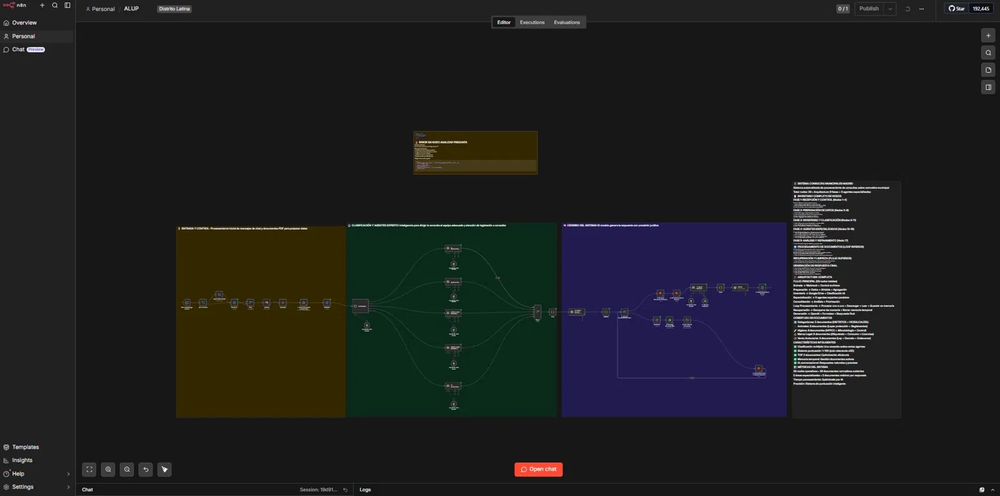
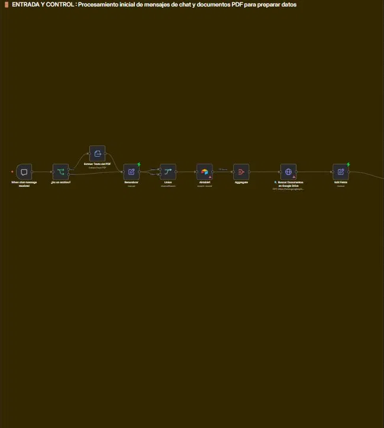
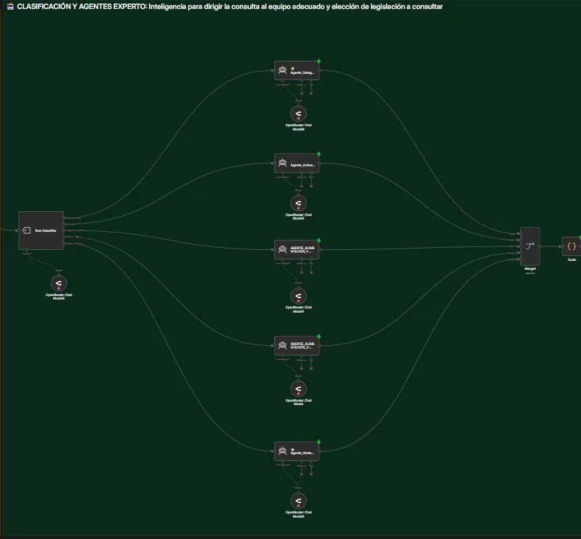
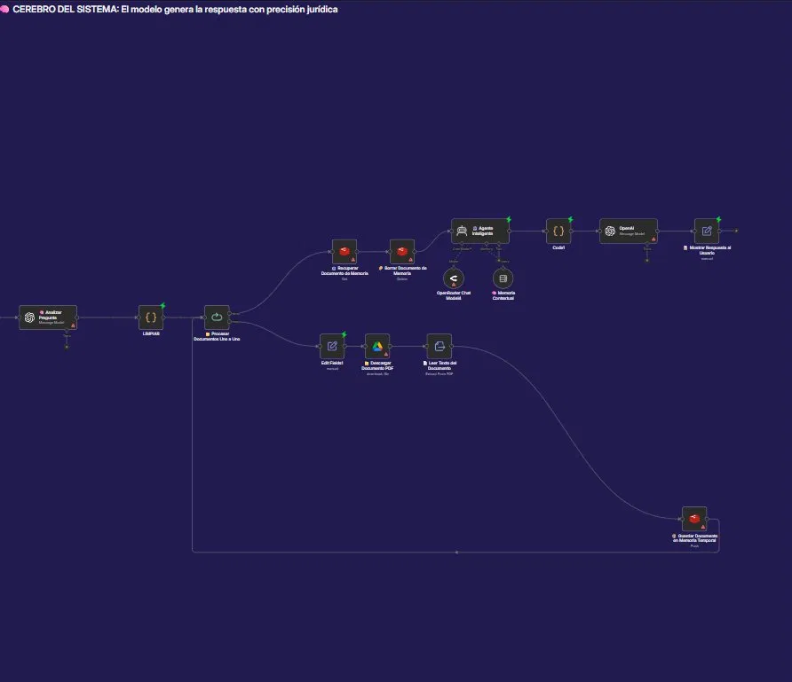

# 🏛️ Municipal AI Legal Framework (ALUP)

> Sistema multi-agente de IA que automatiza la elaboración de informes de alegaciones y la aplicación de legislación en expedientes sancionadores del Ayuntamiento de Madrid — de horas a segundos.

---

## 📌 El problema

Una inspectora de sanidad pública del Ayuntamiento de Madrid tardaba horas en:
- ❌ Determinar qué legislación aplicar en cada expediente sancionador
- ❌ Elaborar informes de alegaciones manualmente
- ❌ Consultar y cruzar reglamentos CE, leyes autonómicas, decretos y ordenanzas municipales

**El trabajo en derecho administrativo exige precisión jurídica total — un error de legislación invalida el expediente.**

---

## ✅ La solución

Sistema multi-agente construido en **n8n** con 5 agentes de IA especializados que automatiza el proceso de principio a fin: desde la recepción del expediente hasta la generación del informe estructurado con normativa aplicable y criterios de sanción.

---

## 🏗️ Arquitectura del sistema



### Fase 1 — Entrada y Control


Recepción de la consulta (texto o PDF vía Google Drive), procesamiento inicial y preparación de datos.

### Fase 2 — Clasificación y Agentes Experto


Text Classifier que deriva automáticamente al agente especializado según la materia:

| Agente | Especialidad |
|---|---|
| Agente_Delegaciones | Competencias municipales y distritales |
| Agente_Animales | Leyes de protección animal y reglamentos |
| AGENTE_ALIMENTACIÓN_T | APPCC, Microbiología y Control sanitario |
| AGENTE_ALIMENTACIÓN_P | Marco legal alimentario |
| Agente_Venta | Venta ambulante: Ley + Decreto + Ordenanza |

### Fase 3 — Cerebro del Sistema


Recuperación de memoria contextual, procesamiento del documento, generación de respuesta con precisión jurídica y entrega al usuario.

---

## 📊 Cobertura de documentos legales

| Área | Documentos |
|---|---|
| Delegaciones | 2 (Distritos + Vicealcaldía) |
| Animales | 8 (Leyes protección + Reglamentos) |
| Higiene | 8 (APPCC + Microbiología + Control) |
| Marco Legal | 8 (Etiquetado + Consumo + Licencias) |
| Venta Ambulante | 3 (Ley + Decreto + Ordenanza) |
| **Total** | **29 documentos normativos** |

---

## ⚙️ Características técnicas

- **29 nodos operativos** organizados en 5 fases
- **Clasificación múltiple:** una consulta activa varios agentes en paralelo
- **Sistema de puntuación 1-100** (solo relevancia ≥50)
- **TOP 3 documentos** por respuesta para optimizar eficiencia
- **Memoria contextual** entre turnos gestionada con Redis
- **Gestión documental** con Airtable + Google Drive

---

## 🛠️ Stack tecnológico

| Tecnología | Rol |
|---|---|
| **n8n** | Orquestación del workflow multi-agente |
| **OpenAI** | Modelos de lenguaje principales |
| **OpenRouter** | Modelos alternativos por agente |
| **Redis** | Memoria contextual entre turnos |
| **Airtable** | Gestión documental y trazabilidad |
| **Google Drive** | Procesamiento de PDFs de expedientes |

---

## 📁 Estructura del repositorio

```
municipal-ai-legal-framework/
├── workflow/
│   └── alup_workflow.json     # Workflow completo de n8n
├── docs/
│   └── arquitectura.md        # Documentación técnica
├── assets/
│   ├── workflow_overview.png  # Vista general del workflow
│   ├── fase1_entrada.png
│   ├── fase2_clasificacion.png
│   └── fase3_cerebro.png
└── README.md
```

---

## 🚀 Cómo importar el workflow

1. Abre tu instancia de n8n
2. **Workflows → Import from file**
3. Selecciona `workflow/alup_workflow.json`
4. Configura las credenciales:
   - OpenAI API Key
   - OpenRouter API Key
   - Redis (host + port)
   - Airtable API Key
   - Google Drive OAuth

---

## ⚙️ Variables de entorno necesarias

```env
OPENAI_API_KEY=sk-...
OPENROUTER_API_KEY=sk-or-...
REDIS_HOST=localhost
REDIS_PORT=6379
AIRTABLE_API_KEY=pat...
```

> ⚠️ **Nunca subas estas claves al repositorio.**

---

## 📈 Impacto

- ⏱️ De **horas** a **segundos** en la elaboración de informes
- ⚖️ Precisión jurídica requerida para derecho administrativo y sector público
- 📄 29 documentos normativos cubiertos automáticamente
- 🔄 3 meses de desarrollo para orquestar 5 agentes con bases de conocimiento distintas

---

*Desarrollado para el Ayuntamiento de Madrid 🏛️ — Inspección de Sanidad Pública*
